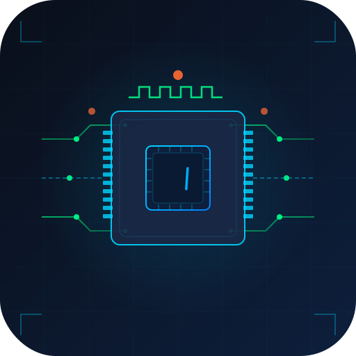
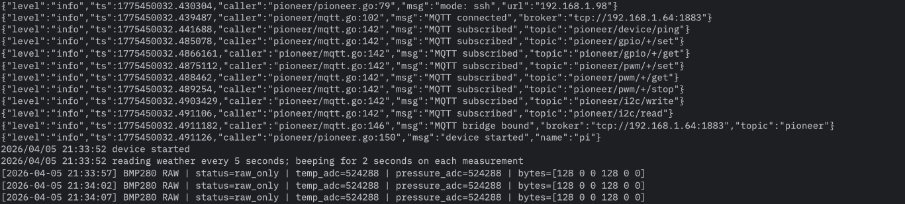
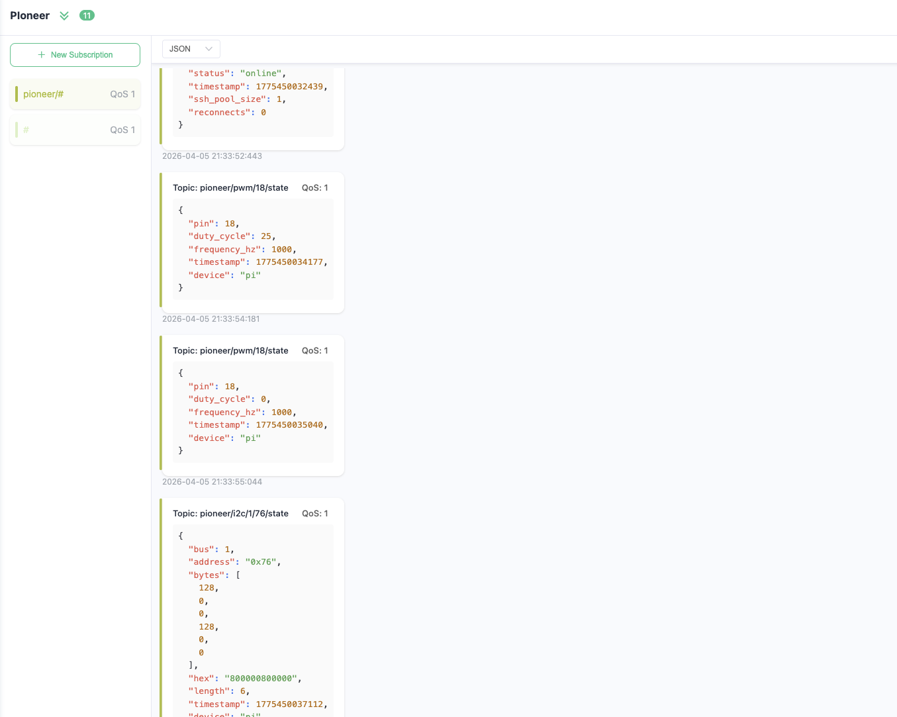

<div align="center">
  

  # PIoneer

  **A Go SDK for Raspberry Pi control, IoT messaging, and MQTT-driven device workflows**

  Control GPIO, PWM, and I2C from Go — locally on the Pi or remotely over SSH — with built-in MQTT publishing, command topics, health signals, and event-driven pin watching.

  <p>
    <a href="https://pkg.go.dev/github.com/EraldCaka/PIoneer">
      
    </a>
    
    
    
    
    
  </p>

  <p>
    <a href="#why-pioneer">Why PIoneer</a>
    ·
    <a href="#installation">Installation</a>
    ·
    <a href="#quick-start">Quick Start</a>
    ·
    <a href="#configuration">Configuration</a>
    ·
    <a href="#mqtt">MQTT</a>
    ·
    <a href="#protocols">Protocols</a>
    ·
    <a href="#testing">Testing</a>
  </p>
</div>

---

## Why PIoneer

Most Raspberry Pi GPIO libraries assume your Go process runs **on the Pi**.

PIoneer gives you both options:

- **`ssh` mode** — run your Go service on your laptop, server, or edge controller and operate the Pi remotely
- **`local` mode** — run directly on the Pi for native hardware access
- **Built-in MQTT** — publish state changes and receive commands through topics
- **Event-driven pin watching** — react to changes without wiring polling logic through your application
- **One SDK, multiple protocols** — digital GPIO, PWM, I2C, health, metrics, and device status

---

## Screenshots

<table>
  <tr>
    <td width="50%">
      
    </td>
    <td width="50%">
      
    </td>
  </tr>
  <tr>
    <td align="center"><sub>SDK logs and device lifecycle output</sub></td>
    <td align="center"><sub>MQTT state and command message flow</sub></td>
  </tr>
</table>

---

## Features

- Remote Raspberry Pi control over SSH
- Local execution mode for direct hardware access
- Digital GPIO read/write support
- PWM control for supported hardware pins
- I2C read/write helpers
- MQTT publish/subscribe integration
- Device health and runtime metrics
- Internal watcher system for edge-triggered workflows
- Structured config-driven startup
- Example apps and broker setup for local testing

---

## Installation

```bash
go get github.com/EraldCaka/PIoneer
```

### External dependency

If you use **SSH mode**, install `sshpass` on the machine running your Go application:

```bash
# macOS
brew install sshpass

# Debian / Ubuntu
sudo apt install sshpass
```

---

## Quick Start

```go
package main

import (
	"log"
	"os"
	"time"

	pioneer "github.com/EraldCaka/PIoneer"
)

func main() {
	file, err := os.Open("config.yaml")
	if err != nil {
		log.Fatal(err)
	}
	defer file.Close()

	device, err := pioneer.New(file)
	if err != nil {
		log.Fatal(err)
	}

	if err := device.Start(); err != nil {
		log.Fatal(err)
	}
	defer device.Stop()

	for {
		_ = device.SetDutyCycle(18, 25.0)
		time.Sleep(5 * time.Millisecond)
		_ = device.StopPWM(18)

		data, err := device.ReadSensor("weather")
		if err != nil {
			log.Println("weather read failed:", err)
		} else {
			log.Println(data)
		}

		time.Sleep(5 * time.Second)
	}
}
```

---

## Execution Modes

PIoneer supports two runtime modes:

```yaml
config:
  mode: "ssh"    # run your app anywhere, control the Pi remotely
  # mode: "local" # run directly on the Pi
```

### `ssh` mode
Use this when your service runs on another machine and talks to the Pi remotely.

### `local` mode
Use this when your binary runs on the Raspberry Pi itself. SSH-specific fields are ignored.

---

## Configuration

Start with a config file:

```bash
cp config.yaml myconfig.yaml
```

### Example

```yaml
config:
  device-name: "pi-main"
  mode: "ssh"
  url: "raspberrypi.local"
  port: "22"
  auth-method: "password"   # password | key
  password: "yourpassword"
  # ssh-key-path: "/home/user/.ssh/id_rsa"
  pool-size: 3
  max-retries: 5
  retry-delay: 3

chip:
  digital-pins:
    - id: "button"
      pin: 5
      value: 0
      direction: 0
      edge: 1

    - id: "led"
      pin: 3
      value: 1
      direction: 1
      edge: 0

  pwm-pins:
    - id: "fan"
      pin: 18
      frequency: 1000
      duty-cycle: 0

  i2c-devices:
    - id: "temp-sensor"
      bus: 1
      address: "0x48"

mqtt:
  broker: "tcp://127.0.0.1:1883"
  client-id: "pioneer-pi-main"
  topic: "pioneer"
  use-tls: false
  qos: 1
```

### Notes

- `digital-pins`, `pwm-pins`, and `i2c-devices` are optional
- Digital `Read()` and `Write()` calls can operate without predeclaring every pin
- PWM pins should be declared in config before use
- MQTT is optional, but once configured the SDK can publish device state and receive control commands

> Do not commit your real `config.yaml`. It contains device connection details and possibly credentials.

```bash
echo "config.yaml" >> .gitignore
```

---

## Protocols

## Digital GPIO

Use digital operations for standard high/low pin control.

```go
val, err := device.Read(pin)
err = device.Write(pin, 1)
```

- `Read(pin)` returns `0` or `1`
- `Write(pin, value)` writes `0` or `1`

---

## PWM

Use PWM for devices like fans, dimmable LEDs, or motor control.

```go
if err := device.SetDutyCycle(18, 75.0); err != nil {
	log.Fatal(err)
}

duty, err := device.GetDutyCycle(18)
if err != nil {
	log.Fatal(err)
}

log.Println("duty:", duty)

if err := device.StopPWM(18); err != nil {
	log.Fatal(err)
}
```

### Typical Raspberry Pi 4 hardware PWM pins

- `12`
- `13`
- `18`
- `19`

---

## I2C

Communicate with sensors and peripherals over I2C.

```go
if err := device.I2CWrite(1, "0x48", []byte{0x01, 0xFF}); err != nil {
	log.Fatal(err)
}

data, err := device.I2CRead(1, "0x48", 2)
if err != nil {
	log.Fatal(err)
}

log.Printf("data: %x", data)
```

---

## Events

Watch a pin and react only when its value changes.

```go
events, err := device.Watch(5)
if err != nil {
	log.Fatal(err)
}
defer device.StopWatch(5)

for event := range events {
	log.Printf(
		"pin %d changed from %d to %d",
		event.Pin,
		event.OldValue,
		event.NewValue,
	)
}
```

This keeps application code cleaner than manual polling loops.

---

## MQTT

When MQTT is configured, PIoneer can:

- publish pin and device state changes
- receive control commands from subscribed topics
- expose health and error signals for automation or monitoring

### Published topics

| Topic | Example payload |
|---|---|
| `pioneer/gpio/<pin>/state` | `{"pin":3,"value":1,"label":"HIGH","direction":"output","timestamp":"..."}` |
| `pioneer/pwm/<pin>/state` | `{"pin":18,"duty_cycle":50.0,"frequency_hz":1000,"timestamp":"..."}` |
| `pioneer/i2c/<bus>/<addr>/state` | `{"bus":1,"address":"0x48","data":[1,255],"hex":"01ff","length":2,"timestamp":"..."}` |
| `pioneer/device/status` | `{"device":"pi-main","status":"online","ssh_pool_size":3,"reconnects":0}` |
| `pioneer/device/error` | `{"protocol":"gpio","error":"...","timestamp":"..."}` |

### Control topics

| Topic | Payload | Action |
|---|---|---|
| `pioneer/gpio/<pin>/set` | `"1"` or `"0"` | Write digital value |
| `pioneer/gpio/<pin>/get` | empty | Read and publish current state |
| `pioneer/pwm/<pin>/set` | `"50.0"` | Set duty cycle |
| `pioneer/pwm/<pin>/stop` | empty | Stop PWM |
| `pioneer/i2c/write` | `{"bus":1,"address":"0x48","data":[1,255]}` | Write bytes |
| `pioneer/i2c/read` | `{"bus":1,"address":"0x48","length":2}` | Read bytes and publish |
| `pioneer/device/ping` | empty | Trigger device status response |

### Practical use cases

- dashboard-driven GPIO toggles
- remote fan or relay control
- sensor ingestion through MQTT pipelines
- edge telemetry and command handling
- device fleet status monitoring

---

## Health and Metrics

PIoneer exposes runtime visibility for operational checks.

```go
health := device.Health()

// health.Connected
// health.Reconnects
// health.ActiveWatchers
// health.MQTTBound
```

```go
metrics := device.Metrics()

// metrics.TotalReads
// metrics.TotalWrites
// metrics.TotalErrors
// metrics.SSHPoolSize
// metrics.Reconnects
```

These are useful for logs, dashboards, and liveness checks.

---

## Raspberry Pi Setup

Run the following on the Pi before using the SDK.

### Required for GPIO access

```bash
echo "pi ALL=(ALL) NOPASSWD: /usr/bin/pinctrl" | sudo tee /etc/sudoers.d/pinctrl
```

### Required for I2C

```bash
sudo apt install -y i2c-tools
sudo raspi-config nonint do_i2c 0
```

### Required for PWM

```bash
sudo apt install -y pigpio
sudo systemctl enable pigpiod
sudo systemctl start pigpiod
```

Then reboot:

```bash
sudo reboot
```

---

## Examples

The repository includes example material and local broker resources under `pioneer-examples/`.

A typical workflow:

```bash
cd pioneer-examples
docker compose up -d
```

Then run your test app against the configured broker and Raspberry Pi target.

---

## Configuration Reference

### `config`

| Field | Type | Default | Description |
|---|---:|---:|---|
| `device-name` | string | — | Logical device identifier |
| `mode` | string | `"ssh"` | `ssh` or `local` |
| `url` | string | — | Raspberry Pi hostname or IP |
| `port` | string | `"22"` | SSH port |
| `auth-method` | string | — | `password` or `key` |
| `password` | string | — | SSH password |
| `ssh-key-path` | string | — | Private key path |
| `pool-size` | int | `3` | Concurrent SSH connections |
| `max-retries` | int | `5` | Retry attempts |
| `retry-delay` | int | `3` | Delay between retries in seconds |

### `digital-pins`

| Field | Type | Description |
|---|---|---|
| `id` | string | Logical identifier |
| `pin` | int | GPIO number |
| `value` | int | Initial value: `0` or `1` |
| `direction` | int | `0=input`, `1=output` |
| `edge` | int | `0=none`, `1=rising`, `2=falling`, `3=both` |

### `pwm-pins`

| Field | Type | Description |
|---|---|---|
| `id` | string | Logical identifier |
| `pin` | int | PWM-capable pin |
| `frequency` | int | Frequency in Hz |
| `duty-cycle` | float | Initial duty cycle, `0-100` |

### `i2c-devices`

| Field | Type | Description |
|---|---|---|
| `id` | string | Logical identifier |
| `bus` | int | I2C bus number |
| `address` | string | Device address such as `"0x48"` |

---

## Testing

PIoneer supports both standard unit testing and real-device integration testing.

### Run unit tests

```bash
go test ./...
```

### Run with coverage

```bash
go test ./... -cover
```

### Run integration tests

```bash
INTEGRATION=1 go test ./pkg/handlers/pioneer/... -v
```

### Run benchmarks

```bash
go test ./pkg/handlers/pioneer/... -bench=. -benchmem
```

---

## Design Notes

PIoneer is built for a practical style of Go development:

- keep application logic on the machine where it belongs
- keep Raspberry Pi access simple and scriptable
- expose hardware operations through clear APIs
- make MQTT a first-class integration path, not an afterthought

This makes it suitable for:

- home automation
- edge control systems
- test rigs
- remote device orchestration
- internal IoT tooling
- Raspberry Pi-backed prototypes that need to become services

---

## License

MIT
